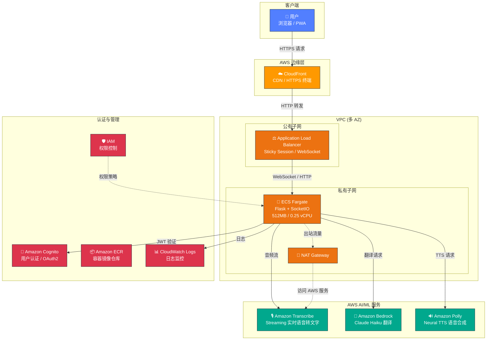
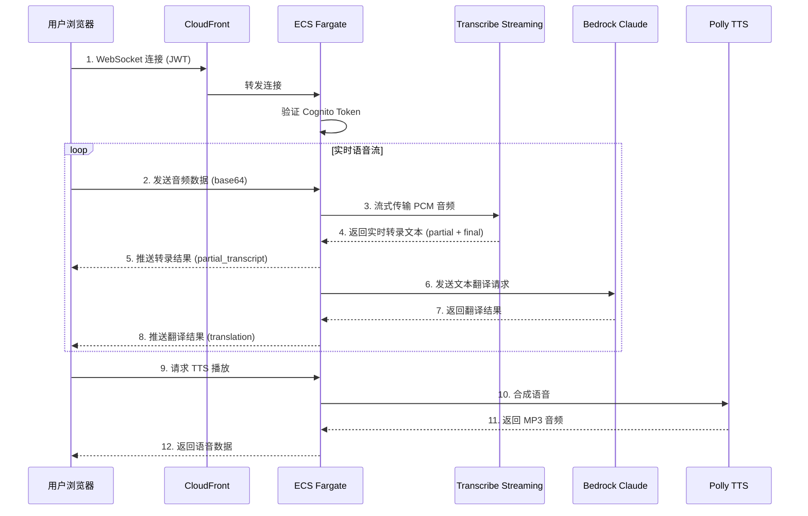

# ASR-Translate：实时语音识别与 AI 翻译系统

基于 AWS 的实时语音识别（ASR）与 AI 同声传译系统，支持英中/中英双向翻译，提供 WebSocket 实时流式传输和 PWA 移动端体验。

## 架构概览



## 数据流



## 技术栈

| 层级 | 技术 | 说明 |
|------|------|------|
| **前端** | HTML5 + JavaScript (SPA) | 单页应用，PWA 支持，Web Audio API 录音 |
| **通信** | WebSocket (Socket.IO) | 实时双向音频/文本传输 |
| **后端** | Flask + Flask-SocketIO | Python 异步处理，多线程翻译 |
| **ASR** | Amazon Transcribe Streaming | 实时语音转文字，支持中/英 |
| **翻译** | Amazon Bedrock (Claude Haiku) | AI 同声传译 |
| **TTS** | Amazon Polly (Neural) | 语音合成，英文 Matthew / 中文 Zhiyu |
| **认证** | Amazon Cognito | OAuth2 / JWT 用户认证 |
| **部署** | AWS CDK + ECS Fargate | 容器化无服务器部署 |
| **CDN** | CloudFront | HTTPS 终端，WebSocket 路由 |

## 功能特性

- **双向实时翻译**：英→中 / 中→英 一键切换
- **智能断句**：语言感知的分段策略，中文按标点/长度断句，英文按句号/逗号断句
- **短句合并**：过短片段暂存合并，确保翻译质量
- **语音播放**：翻译结果可通过 Polly TTS 朗读
- **PWA 支持**：可安装到手机桌面，离线可用
- **安全认证**：Cognito OAuth2 登录，JWT Token 验证

## 前置条件

- **AWS 账户**：需开通 Transcribe、Bedrock (Claude)、Polly 服务
- **AWS CLI**：已配置凭证 (`aws configure`)
- **Python**：3.11+
- **Node.js**：16+（用于 CDK）
- **Docker**：用于构建容器镜像

## 快速开始

### 本地开发

```bash
# 1. 克隆项目
git clone <repo-url>
cd asr-translate

# 2. 安装依赖
pip install -r requirements.txt

# 3. 验证 AWS 连接
python test_aws_connection.py

# 4. 启动应用
python app.py
# 访问 http://localhost:8080
```

> 本地运行需要有效的 AWS 凭证（通过环境变量或 `~/.aws/credentials`），且 IAM 用户/角色需有 Transcribe、Bedrock、Polly 权限。

### Docker 本地运行

```bash
# 构建镜像
docker build -t asr-translate .

# 运行容器（挂载 AWS 凭证）
docker run -p 8080:8080 \
  -v ~/.aws:/root/.aws:ro \
  -e AWS_DEFAULT_REGION=ap-northeast-1 \
  asr-translate
```

## 部署到 AWS

### 1. 安装 CDK 依赖

```bash
cd infra
pip install -r requirements.txt
npm install -g aws-cdk  # 如未安装
```

### 2. CDK 部署

```bash
# 首次部署需要 bootstrap
cdk bootstrap

# 部署（使用现有 VPC）
cdk deploy \
  -c cognito_domain_prefix=my-translate-app \
  -c vpc_id=vpc-xxxxxxxx

# 或自动创建 VPC
cdk deploy \
  -c cognito_domain_prefix=my-translate-app
```

### CDK 参数说明

| 参数 | 必填 | 说明 | 示例 |
|------|------|------|------|
| `cognito_domain_prefix` | ✅ | Cognito 域名前缀（全局唯一） | `my-translate-app` |
| `vpc_id` | ❌ | 现有 VPC ID（不填则自动创建） | `vpc-xxxxxxxxx` |
| `custom_domain` | ❌ | 自定义域名 | `translate.example.com` |

### 3. 部署输出

部署成功后会输出以下信息：

| 输出 | 说明 |
|------|------|
| `ALBUrl` | ALB 直连地址（HTTP） |
| `CloudFrontUrl` | CloudFront 地址（推荐使用，HTTPS） |
| `CognitoUserPoolId` | 用户池 ID |
| `CognitoClientId` | 应用客户端 ID |
| `CognitoDomain` | Cognito 登录页域名 |

### 4. 首次使用

1. 打开 `CloudFrontUrl` 输出的地址
2. 点击「登录」跳转至 Cognito 托管 UI
3. 注册账户（邮箱验证）
4. 登录后选择翻译模式（英→中 / 中→英）
5. 点击麦克风开始实时翻译

## 项目结构

```
asr-translate/
├── app.py                  # Flask 后端主程序
├── requirements.txt        # Python 依赖
├── Dockerfile              # 容器镜像定义
├── setup.sh                # 快速安装脚本
├── test_aws_connection.py  # AWS 连接诊断工具
├── templates/
│   └── index.html          # 前端 SPA 页面
├── static/
│   ├── manifest.json       # PWA 配置
│   ├── service-worker.js   # Service Worker
│   ├── icon-192.png        # 应用图标
│   └── icon-512.png        # 应用图标
└── infra/                  # CDK 基础设施代码
    ├── app.py              # CDK 入口
    ├── stack.py            # CDK Stack 定义
    ├── cdk.json            # CDK 配置
    └── requirements.txt    # CDK 依赖
```

## 环境变量

| 变量名 | 说明 | 默认值 |
|--------|------|--------|
| `COGNITO_REGION` | Cognito 区域 | `ap-northeast-1` |
| `COGNITO_USER_POOL_ID` | 用户池 ID | 空（禁用认证） |
| `COGNITO_CLIENT_ID` | 客户端 ID | 空 |
| `COGNITO_DOMAIN` | Cognito 域名 | 空 |
| `AWS_DEFAULT_REGION` | AWS 默认区域 | `ap-northeast-1` |
| `SECRET_KEY` | Flask 会话密钥 | `dev-secret-key-change-in-prod` |

> 通过 CDK 部署时，Cognito 相关环境变量会自动注入到容器中。

## IAM 权限要求

ECS Task Role 需要以下权限：

```json
{
  "Version": "2012-10-17",
  "Statement": [
    {
      "Effect": "Allow",
      "Action": "transcribe:*",
      "Resource": "*"
    },
    {
      "Effect": "Allow",
      "Action": [
        "bedrock:InvokeModel",
        "bedrock:InvokeModelWithResponseStream"
      ],
      "Resource": "*"
    },
    {
      "Effect": "Allow",
      "Action": "polly:SynthesizeSpeech",
      "Resource": "*"
    }
  ]
}
```

## 销毁资源

```bash
cd infra
cdk destroy
```

## 常见问题

**Q: Bedrock Claude 模型未开通？**
A: 需在 AWS Console → Bedrock → Model access 中申请开通 Claude Haiku 模型访问权限。

**Q: 本地运行时 WebSocket 连接失败？**
A: 确认浏览器允许麦克风权限，且使用 `http://localhost:8080` 访问（非 IP 地址）。

**Q: 部署后 CloudFront 返回 502？**
A: 检查 ECS 任务是否正常运行（CloudWatch Logs），确认容器健康检查通过。
